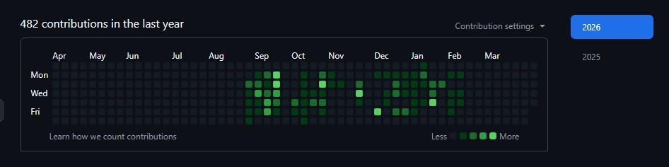

# Nihal K

👋 Hi, I’m **Nihal**, a BCA graduate specialised in Software Development And Web Design from Srinivas University, Mangaluru. I build fast, responsive web apps with React, Next.js, and Node.js and I’m always learning something new!

💬 Feel free to explore my work or reach out for collaboration!

---

## Skills

**Frontend:** HTML5 · CSS3 · JavaScript · React.js · Next.js · TailwindCSS

**Backend:** Node.js (Express.js) · MongoDB · PHP · PostgresSQL

**Languages:** TypeScript · Python · Java · C++ · GoLang

**Tools & Design:** Git · VSCode · Figma · Blender3D  

**Currently Learning:** DSA · System Design · Nextj 16 

---

## Projects

1. **Explore Kasaragod**  
   - **Stack:** Next.js · TypeScript · Tailwind CSS · Prisma · PostgreSQL  
   - **Highlights:**  
     - Built a lightweight, ad-free community-driven directory mapping Kasaragod's finest local food, sights, and services.  
     - Designed with a premium, mobile-first "Warm Minimal" layout focused on privacy and zero-tracker browsing.  
     - Engineered robust database schemas and search operations using Prisma and PostgreSQL.  
   - **Live:** https://explorekasaragod.org  
2. **RenderCard**  
   - **Stack:** Next.js · Vercel Edge Runtime · Dynamic SVG Generation  
   - **Highlights:**  
     - Engineered a dynamic Open Graph (OG) image generation API that designs custom social preview cards in real-time.  
     - Powered by Vercel Edge Runtime for blazing-fast generation with global edge caching and minimal cold-start times.  
     - 100% customizable templates driven dynamically by URL parameters.  
   - **Live:** https://rendercard.vercel.app  
3. **Formcord**  
   - **Stack:** Node.js · Edge Runtime · Web APIs · Discord API  
   - **Highlights:**  
     - Developed a zero-dependency npm library and notification layer connecting client-side forms straight to Discord webhooks.  
     - Built to run seamlessly across all modern JS environments (Node, Serverless, and Edge) using pure Web APIs.  
     - Published as a lightweight, developer-friendly npm package.  
   - **Live:** https://formcord.vercel.app  
   - **Code:** https://github.com/ioNihal/formcord  

---

   

---

## Connect with Me

  <a href="https://www.linkedin.com/in/n1hal" target="_blank">LinkedIn</a> · 
  <a href="https://twitter.com/twnihal" target="_blank">Twitter</a> · 
  <a href="https://dev.to/ionihal" target="_blank">Dev.to</a>

📫 **Email:** [nihal04x@gmail.com](mailto:nihal04x@gmail.com)  
🌐 **Portfolio:** https://ionihal.vercel.app  

---

  

---
### Work Account

---

